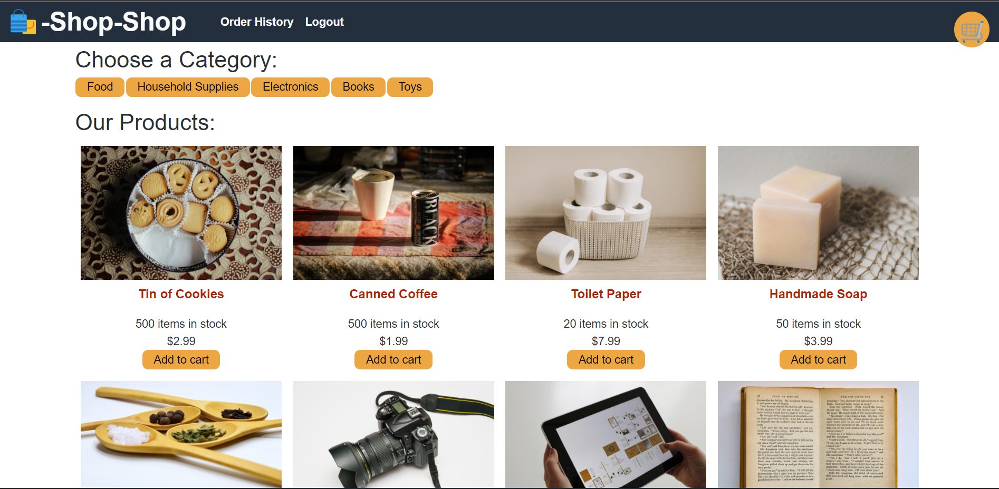

# reduxStore_IJ
## Description
A redux implementation of an activity

## Table of Contents
- [Usage](#usage)
- [Link and Screenshots](#link-and-screenshots)
- [Questions](#questions)

## Usage
After cloning the repo, type 'npm i' to install the necessary packages,  'npm run seed' to seed the database, and finally 'npm run develop' to run the server and client concurrently.

## Link and Screenshots
Here is a link to the [deployed site](https://redux-store-ij.herokuapp.com/)

## Questions
You can find me on [Github](https://github.com/IsaacJCarnes)